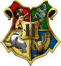

<p align="center">
  
</p>

# Fundadores de Hogwarts

São quatro bruxos que criaram a Escola de Magia e Bruxaria de Hogwarts durante os tempos medievais, no Século X. Esses quatro fundadores são descritos como os mais brilhantes bruxos e bruxas de seu tempo, são eles Godric Gryffindor, Helga Hufflepuff, Rowena Ravenclaw e Salazar Slytherin. Cada um deles criaram as suas próprias casas: Grifinória, Lufa-Lufa, Corvinal e Sonserina. Criando a primeira escola de magia da Grã-Bretanha.

### Objetivo

Um projeto focado em entender melhor como deixar os elementos mais responsivos.

## Instalação das dependências necessárias para executar o projeto

```bash
yarn
# or
npm install
```

### Comando para rodar o projeto

```bash
quasar dev
```
